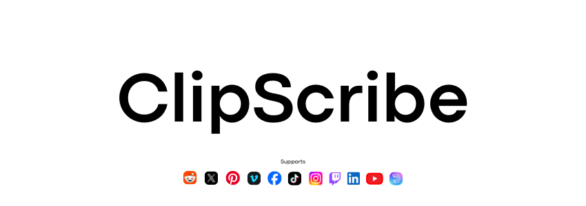

<p align="center">
  
</p>

<h1 align="center">Clipscribe</h1>

<p align="center">
  A lightweight API that takes a video URL and returns a full transcript with timestamped segments.
</p>

<p align="center">
  <a href="LICENSE"></a>
  
  
  
  
  
</p>

---

## Endpoint

### `POST /transcribe`

Takes a video URL, returns the transcript text plus per-segment timestamps.

**Request:**
```json
{
  "url": "https://www.youtube.com/watch?v=dQw4w9WgXcQ"
}
```

**Success (200):**
```json
{
  "transcript": "We're no strangers to love...",
  "segments": [
    {"start": 0.0, "end": 4.22, "text": "We're no strangers to love..."}
  ],
  "duration_seconds": 213.0,
  "platform": "youtube"
}
```

**Error (4xx / 5xx):**
```json
{
  "error": "extraction_failed",
  "detail": "Human-readable explanation of what went wrong."
}
```

| Error key | HTTP code | Meaning |
|---|---|---|
| `extraction_failed` | 422 | yt-dlp couldn't process the URL (bad URL, private video, geo-blocked) |
| `platform_unsupported` | 422 | URL format not recognized by yt-dlp |
| `duration_exceeded` | 422 | Video longer than 20 minutes (not supported) |
| `transcription_failed` | 502 | Groq Whisper API returned an error |

### `GET /health`

```json
{"status": "ok"}
```

---

## Supported Platforms

YouTube · YouTube Shorts · TikTok · Twitter / X · Instagram\* · Facebook\* · Reddit · Twitch · Vimeo · LinkedIn · Pinterest · Dailymotion · Rumble · and [hundreds more](https://github.com/yt-dlp/yt-dlp/blob/master/supportedsites.md)

> \* Instagram and some Facebook/LinkedIn videos require cookies (login session). See deployment guide.

---

## Environment Variables

| Variable | Required | Default | Description |
|---|---|---|---|
| `GROQ_API_KEY` | Yes | — | API key for the Groq Whisper API (`whisper-large-v3-turbo`) |
| `PORT` | No | `8000` | Server port (set automatically by Railway in production) |

---

## Run Locally

**Prerequisites:** Python 3.12+, [ffmpeg](https://ffmpeg.org/), [yt-dlp](https://github.com/yt-dlp/yt-dlp)

```bash
# 1. Install dependencies
pip install .

# 2. Set your API key
cp .env.example .env
# edit .env → set GROQ_API_KEY

# 3. Start the server
uvicorn app.main:app --host 0.0.0.0 --port 8000

# 4. Test
curl -X POST http://localhost:8000/transcribe \
  -H "Content-Type: application/json" \
  -d '{"url": "https://www.youtube.com/watch?v=dQw4w9WgXcQ"}'
```

---

## Deploy to Railway

1. Push this repo to GitHub.
2. Create a new project on [Railway](https://railway.app) and connect the repo.
3. Add `GROQ_API_KEY` to Railway's environment variables.
4. Railway detects the `Dockerfile` and builds automatically.
5. The `railway.json` configures health checks and restart policy.
6. Your app is live on `https://<project>.railway.app`.

**For Instagram / authenticated platforms:** Export cookies from your browser as `cookies.txt`, base64-encode them, store as `COOKIES_TXT` env var, and the Docker entrypoint can decode them at startup.

---

## Stack

| Layer | Technology |
|---|---|
| Framework | [FastAPI](https://fastapi.tiangolo.com/) (async) |
| Audio extraction | [yt-dlp](https://github.com/yt-dlp/yt-dlp) (async subprocess, 16 kHz mono mp3) |
| Transcription | [Groq Whisper API](https://console.groq.com) (`whisper-large-v3-turbo`) |
| Validation | [Pydantic v2](https://docs.pydantic.dev/) |
| Runtime | Python 3.12+ · Docker · Railway |

---

## License

MIT — see [LICENSE](LICENSE).

## Scope

Clipscribe does **one thing**: take a video URL, return a transcript. No database, no auth, no user accounts, no frontend.
